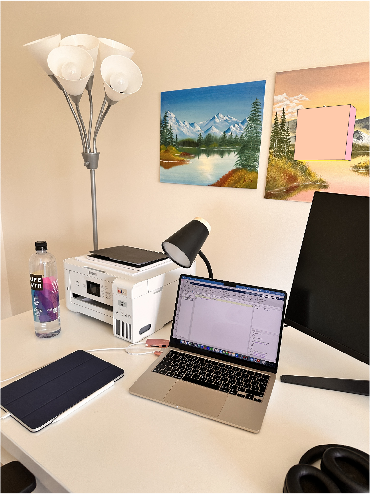

# Offline 3D Augmentation Using COLMAP

### Complete paper for this project can be found [here](https://jasminekhalil.github.io/assets/pdf/colmapproject.pdf) 

This project describes the development of an **Augmented Reality (AR) Viewer** capable of overlaying virtual objects onto images of real-world scenes. Our **offline implementation** integrates concepts from **computer vision, computer graphics, and geometry.** 

Using **COLMAP software** for **3D reconstruction**, we generated a **sparse 3D point cloud** from overlapping camera image views. The key tasks completed include extracting the **dominant plane** using a custom **RANSAC algorithm**, **transforming coordinate systems**, and projecting a virtual 3D object onto 2D images using camera parameters. This project emphasizes foundational mathematical techniques, such as **camera projection and geometric transformations**, with a focus on implementing core algorithms without relying on external computer vision libraries. Our work provides a **solid basis for future real-time AR applications.**

---

## Steps Taken

1. We first captured a set of overlapping images of a 3D scene and used COLMAP to generate a sparse 3D point cloud. 
2. We then developed and implemented a RANSAC algorithm to identify the dominant plane within the scene.
3. After that, we defined a local coordinate system for placing a virtual object.
4. Then, we created a virtual 3D object, transformed it to fit the scene’s geometry, and projected it onto the original images using the pinhole camera model based on internal and external camera parameters.
5. Finally, we rendered the image
views with the virtual object accurately overlaid, achieving an
offline AR viewer.

---

## Initial Views of our Chosen Scene 

 

---

## COLMAP 3D Reconstruction

---

## Dominant Plane of our Scene from RANSAC Algorithm

## 3D Euclidean transformation of 3D Box onto the Dominant Plane

--- 

## Views of our Chosen Scene with the 3D Box Projected Onto the Real Scene

 

- **Email**: [jasminekhalil213@gmail.com](mailto:jasminekhalil213@gmail.com)  
- **LinkedIn**: [JasmineKhalil21](https://www.linkedin.com/in/jasminekhalil21/)